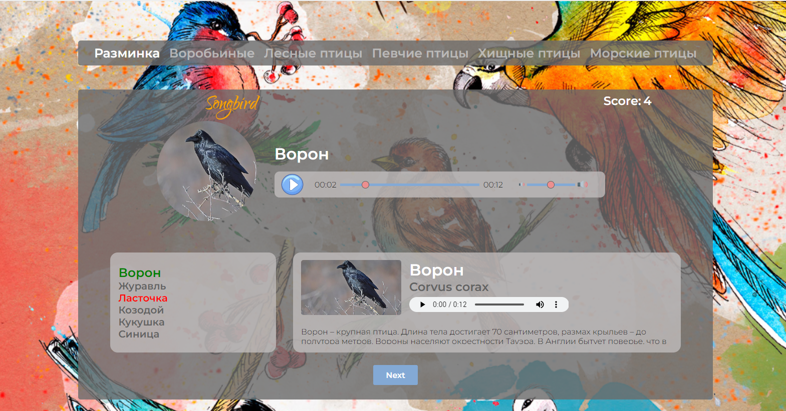
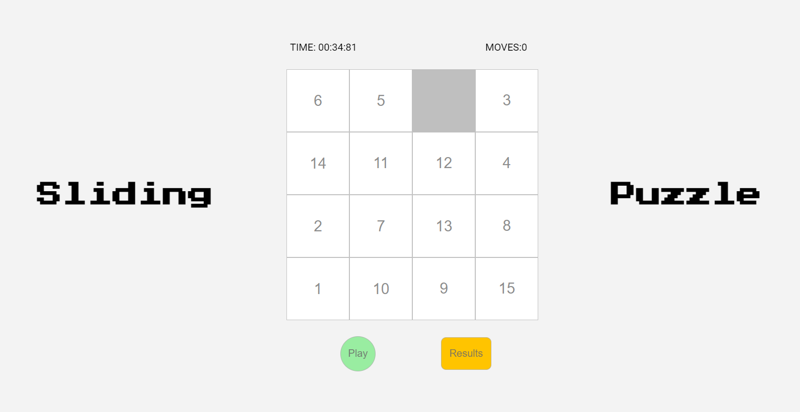
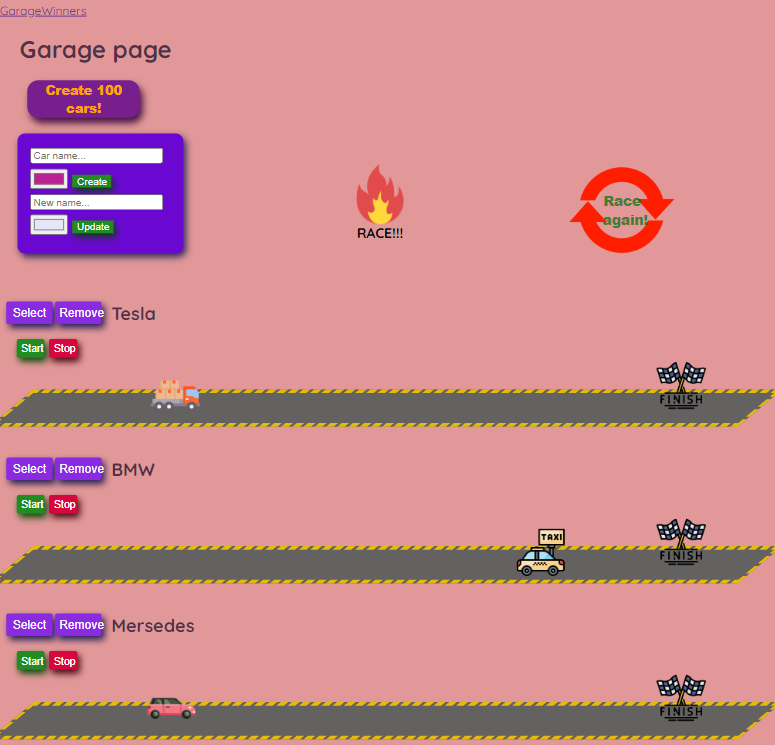
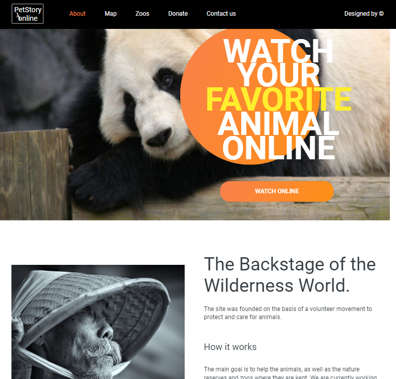

# Hello! This is a small portfolio of my projects. Switch between branches to see them all.
> ## Short description: 
> - Songbird (Guess birds by their voices) 

> - codejam-the-gem-puzzle (Gem puzzle game) 

> - async-race (To see this work you need to start your local server forked from [this repository](https://github.com/mikhama/async-race-api) and after that use my app) 

> - online-zoo (HTML & CSS training) 
